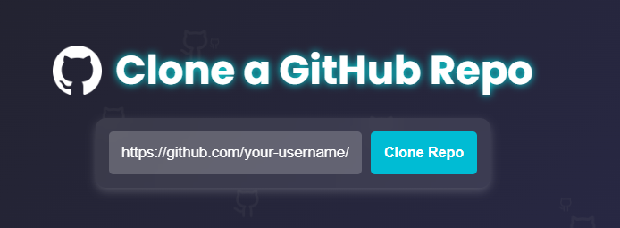

# Full-Stack App Deployment Automation

This project automates the deployment of full-stack applications by cloning a Git repository, detecting the technology stack (frontend, backend, and database), generating Dockerfiles, and deploying the application using Docker Compose. Real-time status updates are provided via WebSocket.

---

## 🚀 Features

- **Repository Cloning**: Clone repositories from GitHub, GitLab, or Bitbucket.
- **Technology Detection**: Automatically identify frontend, backend, and database technologies.
- **Dockerfile Generation**: Generate Dockerfiles based on detected technologies.
- **Docker Compose Integration**: Orchestrate deployment using `docker-compose.yml`.
- **Real-Time Status Updates**: Track deployment progress via WebSocket.
- **Nginx Configuration**: Auto-configure Nginx to serve the frontend and proxy requests to the backend.

---

## 📌 Prerequisites

Ensure you have the following installed:

- [Node.js](https://nodejs.org/) (v14 or higher)
- [Docker](https://www.docker.com/) (v20 or higher)
- [Docker Compose](https://docs.docker.com/compose/) (v2 or higher)

---

## 📂 Valid Project Structure

Your project should follow this structure for seamless deployment:

```
your-repo/
├── frontend/   # Frontend code (React, Vue)
├── backend/    # Backend code (Node.js, Python Flask) (MySQL, PostgreSQL, MongoDB)
├── database/   # Database initialization scripts
│   └── init/   # Folder containing database initialization scripts
└── ...
```

### 🛠 Folder Naming Conventions

| Component  | Accepted Folder Names |
|------------|----------------------|
| **Frontend** | `frontend`, `client`, `web`, `ui`, `app` |
| **Backend** | `backend`, `server`, `api`, `services` |
| **Database** | `database`, `db`, `data`, `storage` |

### 🗄 Database Initialization

The `database/init/` folder must contain SQL scripts for database setup:

```
database/
└── init/
    ├── 01-create-tables.sql
    ├── 02-insert-data.sql
```

### 🔑 Required Environment Variables

These environment variables are essential for the Docker deployment process. Make sure to include them in your project’s environment files so that Docker can set up the deployment correctly.

#### Frontend
- `VITE_API_URL` (Vite) or `REACT_APP_API_URL` (Create React App) → Backend API URL (e.g., `http://localhost:4002/api`)

#### Backend
- `DB_HOST`: Database host (e.g., `db`)  
- `DB_USER`: Database username (e.g., `root`, `postgres`)  
- `DB_PASS`: Database password (e.g., `root`, `postgres`)  
- `DB_NAME`: Database name (e.g., `mydb`)  
- `PORT`: Backend server port (e.g., `4002`)

#### Database
- `MYSQL_ROOT_PASSWORD` (MySQL) or `POSTGRES_PASSWORD` (PostgreSQL) → Root password

---

### 📝 Setting Up Environment Variables

To ensure Docker can handle the deployment process without errors, you need to create a `.env` file in your project root directory . Add the required environment variables based on your stack setup.

**Example `.env` file:**

```env
# Frontend
VITE_API_URL=http://localhost:4002/api   # for Vite
# or
REACT_APP_API_URL=http://localhost:4002/api  # for Create React App

# Backend
DB_HOST=db
DB_USER=root
DB_PASS=root
DB_NAME=mydb
PORT=4002

# Database
MYSQL_ROOT_PASSWORD=root   # for MySQL
# or
POSTGRES_PASSWORD=postgres   # for PostgreSQL
```


### 🛠 Supported Technologies

The project currently supports the following technologies for each component:

#### 🌐 Frontend:
- **React** (with Create React App or Vite)  
- **Vue** (with Vite)

*More frontend frameworks (e.g., Angular, Svelte) will be integrated in the future.*

#### ⚙️ Backend:
- **Node.js** (Express.js or other frameworks)  
- **Python Flask**

*More backend frameworks (e.g., Django, Spring Boot) will be integrated in the future.*

#### 🗄️ Database:
- **MySQL**  
- **PostgreSQL**  
- **MongoDB**

*More databases (e.g., SQLite, Redis) will be integrated in the future.*


## 🏗 SETUP & Installation

Run the following command in your terminal to install dependencies and start both frontend and backend:

### Clone the repository
```sh
git clone https://github.com/drawliin/web-based-auto-deploy-system.git
cd web-based-auto-deploy-system
```
### Install backend dependencies & start backend
```sh
cd nodejs
npm install
node server.js
```
### Install frontend dependencies & start frontend
```sh
cd ../react
npm install
npm run dev
```

## 🎯 Usage

### 🔹 Deploy a Repository



1. Open the frontend in your browser at http://localhost:5173.
2. Enter your GitHub repository URL in the input field.
3. Click the Clone Repo button.
4. The backend will handle cloning the repository and setting up the deployment.
5. Replace `https://github.com/your-username/your-repo.git` with your repository URL.

### 🔹 Monitor Deployment
Track the deployment process in real-time via WebSocket:
```
ws://localhost:5001
```

### 🔹 Access the Deployed Application
Once the deployment is complete, visit:
```
http://localhost:8081
```

---

## 📁 Code Structure

```
.
├── nodejs/
    ├── cloned-repos/   # Directory where cloned repositories are stored
    ├── server.js       # Main Express server file

├── react/
    ├── src/
        ├── App.jsx
        ├── index.jsx
└── ...
```

---

## 🧪 Test with Sample Projects

To quickly test the deployment system, use one of these sample repositories:

1. **React Vite + Node.js + MySQL**  
   🔗 [Fullstack App With NodeJS and MySQL](https://github.com/drawliin/FullStack-React-Node-MySQL.git)  
   ```sh
   https://github.com/drawliin/FullStack-React-Node-MySQL.git
2. **React Vite + NodeJS + PostgreSQL**  
   🔗 [FullStack App With Node and PostgreSQL](https://github.com/drawliin/Fullstack-Node-PostgreSQL.git)  
   ```sh
   https://github.com/drawliin/Fullstack-Node-PostgreSQL.git
   
3. **React CRA + Python Flask + MySQL**  
   🔗 [FullStack App With React (CRA) and FLASK](https://github.com/drawliin/FullStack-ReactCRA-FLASK.git)  
   ```sh
   https://github.com/drawliin/FullStack-ReactCRA-FLASK.git
   
4. **Vue + Node.js + MySQL**  
   🔗 [Fullstack App With VueJS and MySQL](https://github.com/drawliin/FullStack-Vue-MySQL.git)  
   ```sh
   https://github.com/drawliin/FullStack-Vue-MySQL.git
   
5. **React Vite + Python Flask + MongoDB**  
   🔗 [FullStack App With FLASK and MongoDB](https://github.com/drawliin/fullstack-python-mongo.git)  
   ```sh
   https://github.com/drawliin/fullstack-python-mongo.git
   


## 🤝 Contributing
Contributions are welcome! Feel free to open an issue or submit a pull request for improvements.

---
## 🙌 Acknowledgments
- **[Express.js](https://expressjs.com/)** – Web server framework
- **[Docker](https://www.docker.com/)** – Containerization
- **[Socket.IO](https://socket.io/)** – Real-time communication

---

## 📜 License
This project is licensed under the MIT License. See the [MIT License](https://opensource.org/licenses/MIT) for details.
